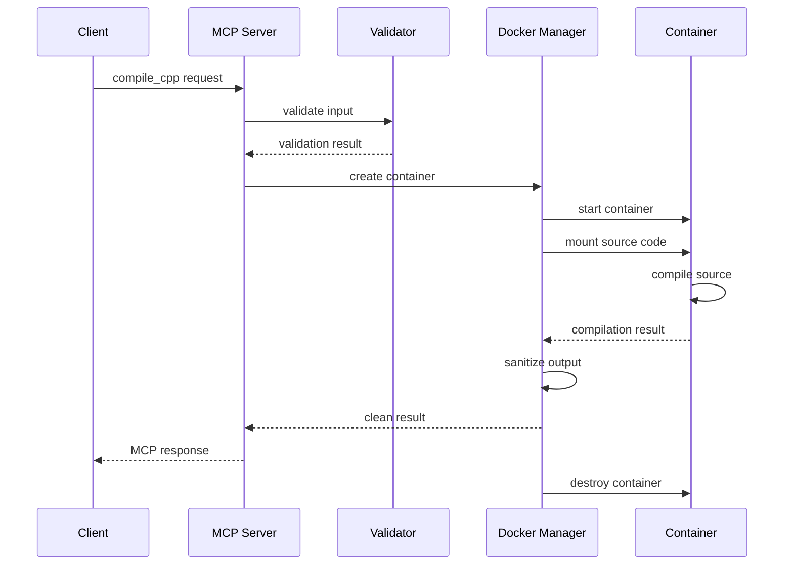

# Design Document: LLVM MCP Server

## System Architecture

### High-Level Architecture

```
┌─────────────────┐    ┌──────────────────┐    ┌─────────────────┐
│                 │    │                  │    │                 │
│   MCP Client    │◄──►│  MCP Server      │◄──►│ Docker Container│
│                 │    │  (Node.js 22)    │    │ (LLVM/Clang)    │
│                 │    │                  │    │                 │
└─────────────────┘    └──────────────────┘    └─────────────────┘
                              │
                              ▼
                       ┌──────────────────┐
                       │                  │
                       │ File System      │
                       │ (Temp Storage)   │
                       │                  │
                       └──────────────────┘
```

### Component Overview

#### 1. MCP Protocol Layer
- **Transport Handlers**: stdio and SSE transport implementations
- **Message Router**: Routes MCP requests to appropriate handlers
- **Protocol Validator**: Validates MCP protocol compliance
- **Response Formatter**: Formats responses according to MCP specification

#### 2. Core Server Components
- **Tool Registry**: Manages available tools (compile_cpp, analyze_cpp, get_ast)
- **Resource Manager**: Handles MCP resources (standards, compiler-info, checkers)
- **Request Validator**: Validates input parameters and sanitizes data
- **Compilation Service**: Orchestrates compilation processes

#### 3. Docker Integration Layer
- **Container Manager**: Manages Docker container lifecycle
- **Volume Manager**: Handles temporary file mounting
- **Process Monitor**: Monitors compilation process execution
- **Resource Controller**: Enforces resource limits

#### 4. Security Layer
- **Input Sanitizer**: Sanitizes source code and compiler flags
- **Output Filter**: Filters sensitive information from outputs
- **Sandbox Controller**: Enforces sandboxing policies
- **Access Control**: Manages file system permissions

## Detailed Component Design

### MCP Protocol Implementation

#### Server Class
```typescript
class LLVMMCPServer {
  private transportHandler: TransportHandler;
  private toolRegistry: ToolRegistry;
  private resourceManager: ResourceManager;
  
  async handleRequest(request: MCPRequest): Promise<MCPResponse> {
    // Route request to appropriate handler
  }
}
```

#### Transport Handlers
- **StdioTransport**: Handles JSON-RPC over stdin/stdout
- **SSETransport**: Handles Server-Sent Events transport
- **Common Interface**: Both implement TransportHandler interface

#### Tool Implementation
```typescript
interface CompilationTool {
  name: string;
  description: string;
  inputSchema: JSONSchema;
  execute(params: CompilationParams): Promise<CompilationResult>;
}
```

### Docker Architecture

#### Container Specification
```dockerfile
FROM node:lts-alpine

# Install LLVM/Clang toolchain
RUN apk add --no-cache \
    clang \
    clang-static-analyzer \
    llvm \
    build-base

# Create non-root user
RUN adduser -D -s /bin/sh compiler

# Set up working directories
WORKDIR /workspace
RUN chown compiler:compiler /workspace

USER compiler
```

#### Container Management
```typescript
class DockerManager {
  async createContainer(config: ContainerConfig): Promise<Container> {
    // Create isolated container for compilation
  }
  
  async executeCompilation(
    container: Container, 
    source: string, 
    options: CompileOptions
  ): Promise<CompilationResult> {
    // Execute compilation with timeout and resource limits
  }
  
  async cleanup(container: Container): Promise<void> {
    // Clean up container and temporary files
  }
}
```

### Security Design

#### Sandboxing Strategy
1. **Container Isolation**: Each compilation runs in a separate Docker container
2. **Network Isolation**: Containers have no network access
3. **Filesystem Isolation**: Read-only root filesystem with temporary writable areas
4. **Resource Limits**: CPU, memory, and disk usage constraints
5. **Process Isolation**: Single-purpose containers that are destroyed after use

#### Input Validation Pipeline
```typescript
class InputValidator {
  validateSourceCode(source: string): ValidationResult {
    // Size limits, encoding validation, content scanning
  }
  
  validateCompilerFlags(flags: string[]): string[] {
    // Whitelist validation, injection prevention
  }
  
  sanitizeIncludes(includes: string[]): string[] {
    // Path validation, directory traversal prevention
  }
}
```

#### Output Sanitization
```typescript
class OutputSanitizer {
  sanitizeCompilerOutput(output: string): string {
    // Remove absolute paths, system information
  }
  
  filterErrorMessages(errors: CompilerError[]): CompilerError[] {
    // Clean error messages, remove sensitive data
  }
}
```

### Data Flow Design

#### Compilation Workflow


#### Error Handling Flow
1. **Input Validation Errors**: Return immediately with validation error
2. **Docker Errors**: Retry once, then return system error
3. **Compilation Errors**: Parse and format compiler diagnostics
4. **Timeout Errors**: Kill container and return timeout error
5. **Resource Errors**: Return resource exhaustion error

### File System Design

#### Temporary File Management
```
/tmp/llvm-mcp-XXXXXX/
├── source/
│   ├── main.cpp          # Source code file
│   └── includes/         # Additional include files
├── output/
│   ├── main.o            # Compiled object file
│   ├── main              # Executable (if linking)
│   └── errors.txt        # Compiler output
└── analysis/
    └── results.json      # Static analysis results
```

#### Volume Mounting Strategy
- **Source Volume**: Read-only mount of source code
- **Output Volume**: Write-only mount for compilation artifacts
- **Temp Volume**: Temporary filesystem for intermediate files

### Performance Design

#### Caching Strategy
1. **Container Image Caching**: Reuse base container images
2. **Compilation Cache**: Cache compilation results for identical inputs
3. **AST Cache**: Cache parsed AST for repeated analysis

#### Resource Management
```typescript
class ResourceManager {
  private activeContainers = new Map<string, Container>();
  private resourceLimits = {
    maxConcurrentCompilations: 10,
    maxMemoryPerContainer: '512m',
    maxCpuPerContainer: '2',
    compilationTimeout: 60000
  };
  
  async acquireResources(): Promise<ResourceToken> {
    // Implement semaphore-based resource allocation
  }
}
```

#### Concurrent Execution
- **Request Queue**: FIFO queue for compilation requests
- **Worker Pool**: Pool of Docker containers for parallel execution
- **Load Balancer**: Distribute requests across available workers

### Monitoring Design

#### Metrics Collection
```typescript
interface CompilationMetrics {
  requestId: string;
  timestamp: Date;
  compilationTime: number;
  resourceUsage: {
    cpu: number;
    memory: number;
    disk: number;
  };
  success: boolean;
  errorType?: string;
}
```

#### Health Checks
1. **Container Health**: Monitor Docker daemon and container status
2. **Resource Health**: Monitor CPU, memory, and disk usage
3. **Service Health**: Monitor MCP protocol responsiveness
4. **Compilation Health**: Monitor success rates and error frequencies

### Extensibility Design

#### Plugin Architecture
```typescript
interface CompilerPlugin {
  name: string;
  version: string;
  supportedLanguages: string[];
  compile(source: string, options: any): Promise<CompilationResult>;
}
```

#### Configuration Management
```typescript
interface ServerConfig {
  docker: {
    image: string;
    resourceLimits: ResourceLimits;
    timeout: number;
  };
  security: {
    allowedFlags: string[];
    maxSourceSize: number;
    sandboxEnabled: boolean;
  };
  performance: {
    maxConcurrentJobs: number;
    cacheEnabled: boolean;
    cacheTTL: number;
  };
}
```

## Testing Architecture

### Unit Testing Strategy
- **Tool Logic**: Test compilation tool implementations
- **Validation Logic**: Test input validation and sanitization
- **Protocol Logic**: Test MCP protocol handling
- **Docker Integration**: Mock Docker operations for unit tests

### Integration Testing Strategy
- **MCP Compliance**: Use @modelcontextprotocol/inspector
- **Container Integration**: Test actual Docker container execution
- **End-to-End**: Test complete compilation workflows

### Performance Testing Strategy
- **Load Testing**: Simulate multiple concurrent compilations
- **Stress Testing**: Test resource exhaustion scenarios
- **Benchmark Testing**: Measure compilation performance across different code types